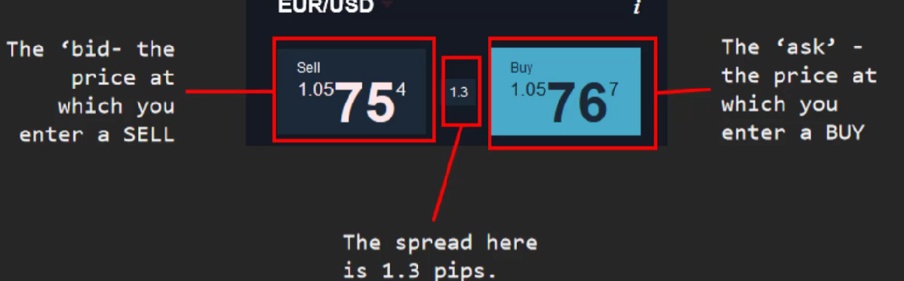
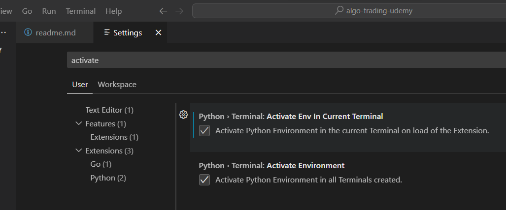

# Spread: different between Buy and Sell price:

(1.05767 - 1.05754) * 10,000 = 1.3.  Multiply by 10,000 because the pip is the at fourth decimal place.

python -m venv venv  
Remember, each time:  venv/scripts/activate
/View /Command Palette, python interpreter

## Auto Activate Environment:
Open command palette: Ctrl+Shift+P
Search for:  User Settings
Search for: activate
  